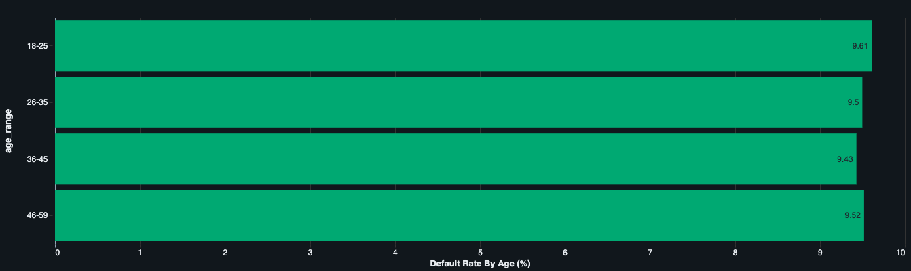
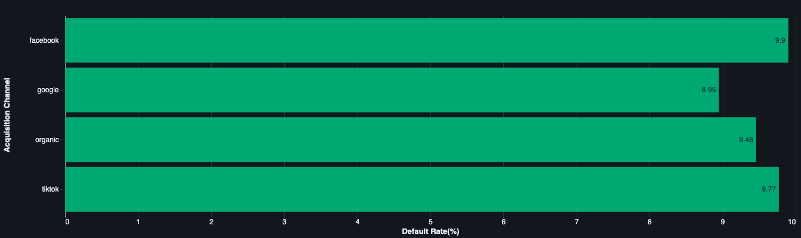
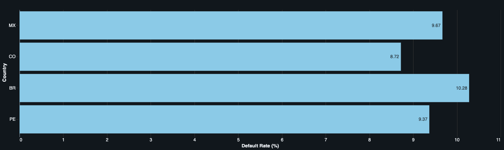
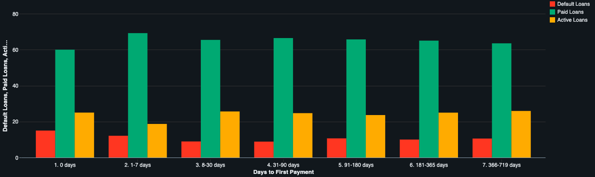

# Loan Portfolio Analysis

SQL-based analysis of a fintech loan portfolio focused on repayment behavior, credit risk, and borrower segmentation.

## Project Overview

This project analyzes a lending dataset to understand portfolio performance, default behavior, and repayment patterns. The goal is to identify risky borrower segments and provide actionable recommendations for the risk team.

## Business Questions

- What is the overall health of the loan portfolio?
- Which segments appear to be riskier?
- How does borrower behavior relate to default risk?
- How long does it take borrowers to make their first payment?

## Dataset

The analysis uses three main tables:

- `users`
- `loans`
- `transactions`

## Key Analyses

- Loan status distribution
- Default rate by age
- Default rate by acquisition channel
- Default rate by country
- Time between disbursement and first payment
- Repeat borrowers and default behavior
- Average loan amount by status

## Key Insights

- Most loans are in `paid` status, indicating generally healthy portfolio performance.
- Default rates are relatively consistent across demographic and acquisition segments.
- Behavioral patterns, especially delayed first payment, appear to be more informative than static demographic segments.
- Loan amount does not differ significantly across statuses, suggesting that repayment behavior may be a stronger risk indicator than loan size alone.

## Business Recommendations

- Prioritize behavioral indicators such as time to first payment.
- Monitor borrowers who delay their first payment after disbursement.
- Use repayment behavior as an input for risk scoring.
- Complement demographic segmentation with transactional and behavioral data.

## Visualizations

### Loan Status Distribution

### Default Rate by Age

### Default Rate by Acquisition Channel

### Default Rate by Country

### Days to First Payment

## SQL Techniques Used

- CTEs
- CASE statements
- Conditional aggregation
- Window functions
- Joins
- DATEDIFF
- GROUP BY / HAVING

loan-portfolio-analysis
│
├── notebook
│   └── loan_portfolio_analysis.html
│
├── queries
│   └── analysis_queries.sql
│
├── images
│   ├── default_rate_by_age.png
│   ├── default_rate_by_channel.png
│   ├── default_rate_by_country.png
│   ├── loan_status_distribution.png
│   └── days_to_first_payment_distribution.png
│
└── README.md
